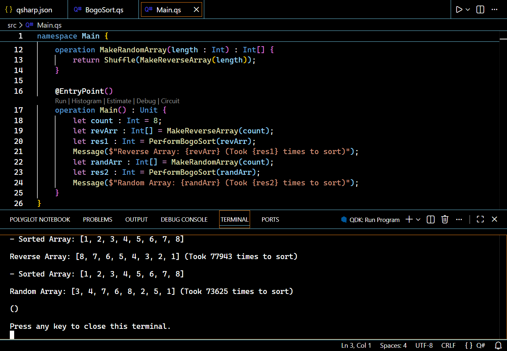

# `BogoSort.QSharp` - Quantum-Powered Monkey Sort



## Overview
`BogoSort.QSharp` is a fun, educational Q# project that implements the notorious **BogoSort** (a.k.a. Monkey Sort) algorithm - infamous for its absurd inefficiency - powered by **true quantum randomness**. Instead of classical pseudo-random number generators, this implementation leverages quantum superposition and measurement to shuffle arrays, turning a silly sorting algorithm into a practical way to explore quantum computing concepts in Q#.

BogoSort operates on a delightfully simple (and wildly inefficient) premise: repeatedly shuffle the array at random until it happens to be sorted. By replacing classical randomness with quantum randomness, this project becomes an engaging tool to learn Q# basics while experimenting with one of computer science's most chaotic sorting algorithms.

## Key Features
- **Quantum Random Shuffling**: Uses Q#'s quantum bits (`Qubit`) and Hadamard (`H`) gates to generate true random bits, ensuring unbiased array shuffling (no pseudo-randomness here!)
- **Educational Focus**: Demonstrates core Q# concepts: quantum operations, mutable/immutable variables, generic array manipulation, and integration with Q# standard libraries
- **Dual Test Cases**: Includes pre-built tests for both reverse-sorted (worst-case scenario) and randomly shuffled arrays to showcase sorting behavior
- **Clean Architecture**: Modular separation of quantum randomness logic, shuffling mechanism, and sorting algorithm for easy understanding and extension
- **Real-time Feedback**: Displays intermediate results and final sorting statistics for educational insight

## Prerequisites
Before running the project, ensure you have the following installed:
- [.NET SDK 6.0+](https://dotnet.microsoft.com/download) (required for Q# runtime)
- [Visual Studio Code](https://code.visualstudio.com/) (recommended IDE)
- [Q# Extension for VS Code](https://marketplace.visualstudio.com/items?itemName=quantum.quantum-devkit-vscode) (Quantum Development Kit - QDK)
- Basic familiarity with Q# syntax and quantum computing fundamentals (optional, but helpful)

## Installation
1. Clone or download the project repository to your local machine
2. Open the project folder in Visual Studio Code
3. Ensure the Q# extension is activated (check the "Extensions" tab)
4. No additional dependencies required - all Q# standard libraries (`Std.Arrays`, `Std.Convert`, `Std.Math`) are included with the QDK

## Project Structure
The project follows a clean, modular structure with two core Q# files:

### 1. `BogoSort.qs` - Quantum-Powered Sorting Engine
- `RandomBit()`: Generates true random bits using quantum superposition and measurement
- `RandomInt(min: Int, max: Int)`: Creates range-bound random integers from quantum-generated bits
- `Shuffle<'T>(array: 'T[])`: Implements a quantum-randomized Fisher-Yates shuffle for generic arrays
- `PerformBogoSort(array: Int[])`: Core BogoSort logic with shuffle-until-sorted implementation

### 2. `Main.qs` - Entry Point & Test Harness
- `MakeReverseArray(length: Int)`: Creates a reverse-sorted array (worst-case for BogoSort)
- `MakeRandomArray(length: Int)`: Generates a randomly shuffled array
- `Main()`: Executes tests on both array types and displays results

## How It Works

### 1. Quantum Randomness Foundation
The project's core is the `RandomBit()` operation, which harnesses quantum mechanics to generate true randomness:
1. **Qubit Allocation**: A quantum bit is allocated and initialized to the `|0⟩` state
2. **Superposition**: The Hadamard (`H`) gate puts the qubit into a perfect 50/50 superposition of `|0⟩` and `|1⟩`
3. **Measurement**: Observing the qubit collapses its superposition to a definite `0` or `1` (stored as a `Result` type)
4. **Cleanup**: The qubit is reset to `|0⟩` (Q# requirement) and released back to the quantum register

### 2. BogoSort Algorithm Flow
1. **Input**: An unsorted integer array (e.g., reverse-sorted `[8,7,6,...,1]`)
2. **Shuffle**: The array is randomized using `Shuffle()`, which relies on `RandomInt()` for unbiased index selection
3. **Check**: `Std.Arrays.IsSorted` verifies if the array is sorted in ascending order
4. **Repeat**: If not sorted, the process repeats with a new quantum-random shuffle
5. **Output**: When sorted, the result and number of attempts are displayed (as shown in the screenshot above)

## Usage
```bash
git clone https://github.com/Pac-Dessert1436/BogoSort.QSharp.git
cd BogoSort.QSharp
```

### Run the Project
1. Open the project in Visual Studio Code
2. Verify there are no syntax errors (check the "Problems" tab)
3. Open the integrated terminal
4. Execute the project using the Q# CLI:
   ```bash
   dotnet run
   ```
   (Alternatively, use the "Run" button in VS Code with the Q# debugger)

### Example Output
As shown in the screenshot above, the program displays:
- The original unsorted arrays (reverse-sorted and random)
- The sorted result for each array
- The number of shuffle attempts required to achieve sorting

### Customization Options
- **Adjust Array Size**: Modify the `count` variable in `Main()` (recommended: `≤ 8` for reasonable runtimes)
- **Change Sort Order**: Update the comparator in `IsSorted` (e.g., `(a, b) -> a > b` for descending order)
- **Extend to Other Types**: Leverage the generic `Shuffle<'T>` operation to sort non-integer arrays (ensure the comparator matches the type)
- **Modify Randomness**: Experiment with different quantum random bit generation techniques

## Limitations & Fun Facts
- **Algorithmic Efficiency**: BogoSort has an average time complexity of `O(n! * n)` - it's *extremely* inefficient! For `n=10`, there are 3.6 million possible permutations
- **Quantum Advantage?**: No - this project uses quantum randomness for education, not performance. BogoSort remains inefficient, but the shuffle is now "truly random"
- **Practical Limits**: Arrays longer than 8 elements may take minutes or hours to sort due to the algorithm's exponential complexity
- **Educational Value**: Perfect for demonstrating algorithm efficiency (by example of what *not* to do) and quantum randomness concepts

## License
This project is licensed under the MIT License. See the [LICENSE](LICENSE) file for complete details.

## Acknowledgements
- The **Q# Team** for the Quantum Development Kit and comprehensive standard libraries
- Computer science educators everywhere for using BogoSort to teach algorithm efficiency
- "Monkey Sort" enthusiasts for keeping this delightfully inefficient algorithm alive

---

Happy quantum shuffling - may the quantum odds be in your favor! 🐒⚛️